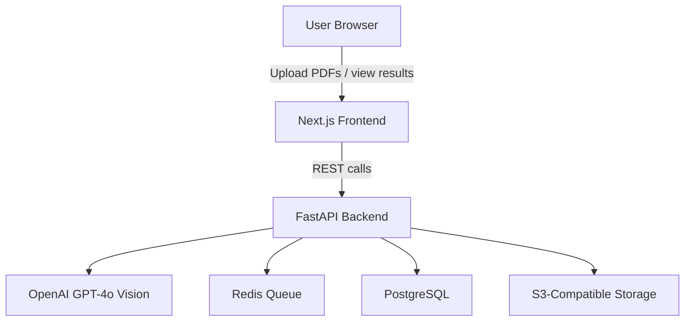

# AI Document Processor: Operations Manual

This manual explains how to install, configure, and operate the AI Document Processor for day-to-day document intake. It is organized so new operators can get productive quickly while giving administrators clear guardrails for maintenance and security.

## Table of Contents
- [1. System Overview](#1-system-overview)
- [2. Installation Paths](#2-installation-paths)
  - [2.1 Quick Docker Launch](#21-quick-docker-launch)
  - [2.2 Local Development Stack](#22-local-development-stack)
- [3. Configuration](#3-configuration)
  - [3.1 Environment Variables](#31-environment-variables)
  - [3.2 Network & Ports](#32-network--ports)
  - [3.3 Credentials & Secrets](#33-credentials--secrets)
  - [3.4 Access Control](#34-access-control)
- [4. Day-to-Day Operations](#4-day-to-day-operations)
  - [4.1 Starting Services](#41-starting-services)
  - [4.2 Uploading & Processing Documents](#42-uploading--processing-documents)
  - [4.3 Reviewing & Exporting Results](#43-reviewing--exporting-results)
  - [4.4 Monitoring Jobs](#44-monitoring-jobs)
- [5. Data Management](#5-data-management)
- [6. Troubleshooting](#6-troubleshooting)
- [7. Maintenance & Updates](#7-maintenance--updates)
- [8. Support Checklist](#8-support-checklist)

## 1. System Overview



**Core flow:** Users upload PDFs through the Next.js UI. The FastAPI backend orchestrates GPT-4o Vision extraction, persists results to PostgreSQL, and stores file assets in S3-compatible storage while Redis tracks job progress.

## 2. Installation Paths

### 2.1 Quick Docker Launch
Use this option for production-like deployments or quick evaluation.

1. Install Docker and Docker Compose.
2. Copy environment defaults and add your keys:
   ```bash
   cp .env.example .env
   # Populate OPENAI_API_KEY and any storage credentials
   ```
3. Start the stack with automatic port detection:
   ```bash
   ./start-local.sh
   # or
   docker-compose -f docker-compose.local.yml up --build
   ```
4. Open the URLs printed in the terminal (default: frontend on `http://localhost:3000`, API docs on `http://localhost:8000/docs`).

> **Tip:** The Docker stack includes PostgreSQL and Redis so you can test queueing and persistence end-to-end.

### 2.2 Local Development Stack
Choose this path when iterating on code or running only the necessary services.

```bash
# Frontend
cd frontend && npm install && npm run dev

# Backend
cd backend && pip install -r requirements.txt && python start.py

# All-in-one helper
./scripts/dev.sh
```

## 3. Configuration

### 3.1 Environment Variables
Add these to `.env` before launch:
- `OPENAI_API_KEY` — Required for GPT-4o Vision requests.
- `DATABASE_URL` — PostgreSQL connection string (set by Docker Compose by default).
- `REDIS_URL` — Redis connection URI (Docker Compose default available).
- `S3_BUCKET`, `S3_ACCESS_KEY`, `S3_SECRET_KEY`, `S3_ENDPOINT` — Required for file storage.
- `FRONTEND_PORT` / `BACKEND_PORT` — Override defaults if ports are in use.

### 3.2 Network & Ports
- **Frontend:** 3000 (Next.js)
- **Backend API & docs:** 8000 (FastAPI + Swagger)
- **Redis:** 6379
- **PostgreSQL:** 5432

> Adjust the ports in `docker-compose.local.yml` or `.env` if these are occupied.

### 3.3 Credentials & Secrets
- Store `.env` outside version control.
- Rotate `OPENAI_API_KEY` and storage credentials regularly.
- Limit database users to least privilege (read/write for app, admin for maintenance).

### 3.4 Access Control
- **Default:** Login is disabled on first install so operators can verify the pipeline quickly.
- **Enable via UI:** Open the homepage, find the **Access control** card, enter a passcode twice, and click **Enable login**. An overlay prompt will then appear for future sessions.
- **API endpoints:**
  - `GET /api/v1/auth/status` — returns whether login is required and if a passcode is configured.
  - `PUT /api/v1/auth/settings/login` — set `require_login=true` with a `passcode` to enable, or `false` to disable.
  - `POST /api/v1/auth/login` — exchange the passcode for a bearer token; required when the lock is on.
- **Reset:** If the passcode is lost, send `require_login=false` to `/auth/settings/login` from a trusted environment to reopen the UI, then re-enable with a fresh passcode.

## 4. Day-to-Day Operations

### 4.1 Starting Services
- **Docker:** `./start-local.sh` (wait for containers to show healthy status).
- **Direct run:** use `./scripts/dev.sh` to start both frontend and backend with auto-install of missing dependencies.
- Confirm availability by opening the frontend URL and verifying the API docs at `/docs`.

### 4.2 Uploading & Processing Documents

```mermaid
sequenceDiagram
    participant U as User
    participant FE as Frontend (Next.js)
    participant BE as Backend (FastAPI)
    participant Q as Redis Queue
    participant AI as GPT-4o Vision
    participant DB as PostgreSQL

    U->>FE: Drag & drop PDF / click Upload
    FE->>BE: POST /api/v1/documents/upload
    BE->>Q: Enqueue processing job
    Q->>AI: Request vision extraction
    AI-->>Q: Structured JSON result
    Q->>DB: Save results & metadata
    FE<--BE: Job ID + initial status
```

1. **Upload** via drag-and-drop or file picker on the dashboard.
2. The app returns a **Job ID** and initial status.
3. Processing occurs asynchronously; status automatically refreshes in the UI.

### 4.3 Reviewing & Exporting Results
- Open the processed document entry to view extracted fields and tables.
- Click **Export to Excel** to download a formatted workbook. Template mode unifies columns across batches.
- Use **Metadata** panels to verify page counts, confidence scores, and timestamps.

### 4.4 Monitoring Jobs
- Watch the in-app progress indicator for each upload.
- API option: `GET /api/v1/documents/{id}/status` returns current state and any error messages.
- Redis and PostgreSQL logs (Docker container output) provide backend insight if jobs stall.

## 5. Data Management
- **Re-exports:** Stored JSON in PostgreSQL enables re-exporting to Excel without re-processing originals.
- **Storage hygiene:** Periodically clean unused uploads from the S3 bucket to control costs.
- **Backups:** Schedule database backups before upgrades and after major batch imports.

## 6. Troubleshooting
- **Ports already in use:** Set `FRONTEND_PORT`/`BACKEND_PORT` in `.env` or stop conflicting services.
- **Missing API key:** Requests will fail with authentication errors—confirm `OPENAI_API_KEY` is set and re-start.
- **Slow processing:** Check Redis queue depth and CPU usage; consider scaling worker containers.
- **Export issues:** Ensure PostgreSQL is reachable; the Excel export relies on stored JSON results.

## 7. Maintenance & Updates
- Pull the latest code and rebuild containers: `git pull && docker-compose -f docker-compose.local.yml up --build`.
- Run sanity checks after updates:
  - Backend: `cd backend && pytest`
  - Frontend: `cd frontend && npm run lint`
- Review `DEPLOYMENT.md` and `PRODUCTION_DEPLOY.md` for environment-specific steps.

## 8. Support Checklist
Use this quick list when assisting operators:
- [ ] Services running (frontend, backend, Redis, PostgreSQL)
- [ ] `.env` populated with valid keys
- [ ] Upload succeeds and returns a Job ID
- [ ] Status transitions to **completed** within expected SLA
- [ ] Results export to Excel without errors
- [ ] Backups verified after large imports

---

For further reference, see:
- [README](../README.md) for feature highlights
- [DEPLOYMENT](../DEPLOYMENT.md) and [PRODUCTION_DEPLOY](../PRODUCTION_DEPLOY.md) for environment guidance
